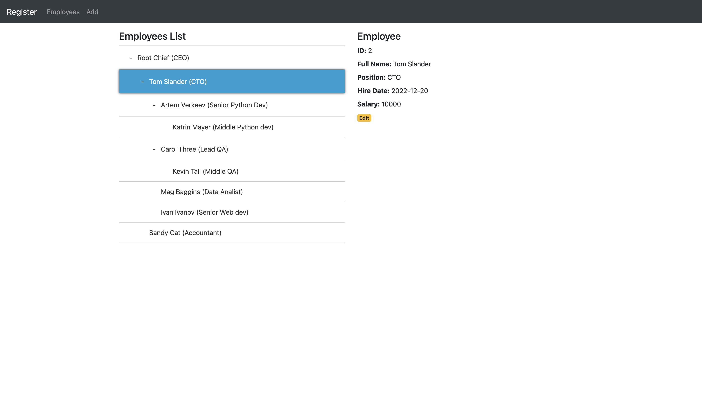

# Employees register test task
### Task description:
```text
Create a web page which will display employees list in tree-hierarchy like form.
Each employee data should be stored in DB and consists from following data:
 - Full name
 - Position
 - Hire date
 - Salary
Each employee has a chief
There is create/update functionality
Don't forget to display employee's position

Tech requirements:
python 3.10+, aiohttp 3.8+, postgresql 13+, docker/docker-compose (optional)
```



## Tech stack:
- python 3.10
- aiohttp 3.8
- SqlAlchemy 1.4

## To build and run:
```bash
make build
make migrate
make start
```

## Linters:
```bash
make isort
make flake8
make mypy
```

## Tests:
```bash
make tests
```

## All commands with makefile:
```bash
make help
```

## After start:
Follow http://localhost:8070/ path to open UI
